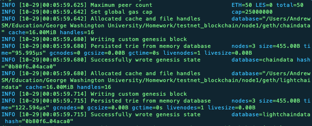

# Instructions

## Create Nodes

Node1 is created along with its private and public keys:

Node2 is created along with its private and public keys:

It's generally a good idea to save node keys in a text file.  The keys can also be found in the node's 'keystore' folder.

## Create Genesis Block and Network

Run puppeth in terminal:

Choose a name for your new network.  In the above situation, there is an existing genesis.  Otherwise, option 2 is replaced with "Configure new genesis from scratch.  Select 'manage existing genesis', remove it, then configure a new genesis.  For this exercise, we are using proof of authority.

Provide the node addresses for accounts that are allowed to seal query.  Both of these addresses should also be designated for pre-funding.  You can enter a specific number for the chain ID or have it default to a random number.

Run puppeth again and choose 'Manage existing genesis'.  This is the genesis block you just created.  Then select 'Export existing genesis'

This action creates .json files.  You will need the [your-network-name].json file to initial the nodes in the next step.

## Initialize Nodes

Initialize node 1:

The following log is returned:

Initialize node 2:

The following log is returned:

Note that the genesis network .json file is passed through as a parameter of the init command.

## Run Nodes (Proof of Authority)

Run node 1:

The following log is created:

While the log is running, make sure to enter the password set up when creating the node.  This will unlock the account.

Run node 2:

Note that you will need to enter the enode address of node1 after --bootnodes.  This allows node 2 to find node1 as a peer in the network.  As with node 1, enter the node 2 account password in the ensuing log to unlock the node.  A similar 'unlock' confirmation message should appear.

