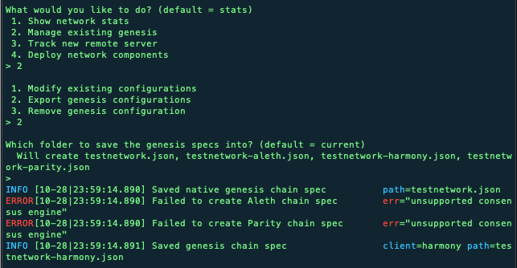

# Instructions

## Create Nodes

Node1 is created along with its private and public keys:

Node2 is created along with its private and public keys:

It's generally a good idea to save node keys in a text file.  The keys can also be found in the node's 'keystore' folder.

## Create Genesis Block and Network

Run puppeth in terminal:

Choose a name for your new network.  In the above situation, there is an existing genesis.  Otherwise, option 2 is replaced with "Configure new genesis from scratch.  Select 'manage existing genesis', remove it, then configure a new genesis.  For this exercise, we are using proof of authority.

Provide the node addresses for accounts that are allowed to seal query.  Both of these addresses should also be designated for pre-funding.  You can enter a specific number for the chain ID or have it default to a random number.

Run puppeth again and choose 'Manage existing genesis'.  This is the genesis block you just created.  Then select 'Export existing genesis'

This action creates .json files.  You will need the [your-network-name].json file to initial the nodes in the next step.

